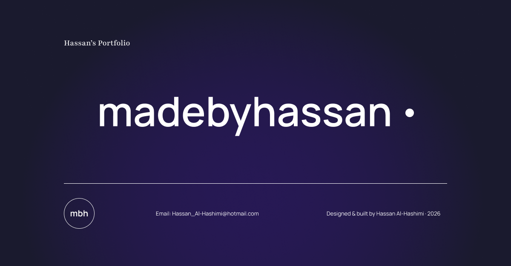

# Hassan Al-Hashimi — UX/AI Engineer

Designed in Figma, built in React.

**Live site:** [madebyhassan.com](https://madebyhassan.com)



## What this project shows

- **Design to code, end to end.** Every page started in my own Figma design system and was built by hand in React and Tailwind CSS. No templates or site builders.
- **A design system carried into code.** Colour, typography and spacing decisions from Figma are applied consistently through reusable components and Tailwind styles.
- **Accessibility built in.** Semantic landmarks (`<nav>`, `<main>`, `<footer>`), one `<h1>` per page, and a keyboard-safe mobile menu that closes with Escape, announces its state to screen readers, and is unreachable while hidden.
- **Content-driven architecture.** Every case study is generated from one data file (`src/data/projects.js`), so adding a project means adding data, not building a new page.

## Featured project: Paliux

Paliux is an AI-powered UX critique tool I designed and built on my own. A user submits a design as a description, an uploaded file, or a live URL, and gets back a structured analysis. Each finding is traced to a published principle from a curated rubric of 30+ (Nielsen's heuristics, WCAG 2.1, Laws of UX).

It is now evolving into a Chrome extension that checks live pages for UX and accessibility issues before launch.

**What building it taught me**

- **Shipping a whole product alone.** Research, wireframes, a design system, a React frontend, serverless API functions on Vercel, and a Supabase backend, all owned end to end.
- **Prompt engineering is product design.** Turning a rubric into instructions a model follows reliably took far more iteration than the interface did.
- **You can't improve what you don't measure.** I built an evaluation pipeline with labelled test cases to compare the AI's findings against expert judgement, and learnt that judgement-based feedback has to be measured with precision and recall rather than a single accuracy score.
- **Real-world constraints break naive builds.** Image size limits, token budgets, extracting a page's structure with headless Chromium, and bugs that only appeared on the deployed endpoint all forced me to rethink parts of the architecture.

[Read the full Paliux case study →](https://madebyhassan.com/project/1)

## Tech stack

React · Vite · Tailwind CSS · HTML · API · Supabase · EmailJS · Vercel

## Run it locally

```bash
git clone https://github.com/Madebyhassan/portfolio.git
cd portfolio
npm install
npm run dev
```

## Contact

- **LinkedIn:** [linkedin.com/in/hassan-alhashimi](https://www.linkedin.com/in/hassan-alhashimi/)
- **Email:** [Hassan_Al-Hashimi@hotmail.com](mailto:Hassan_Al-Hashimi@hotmail.com)
